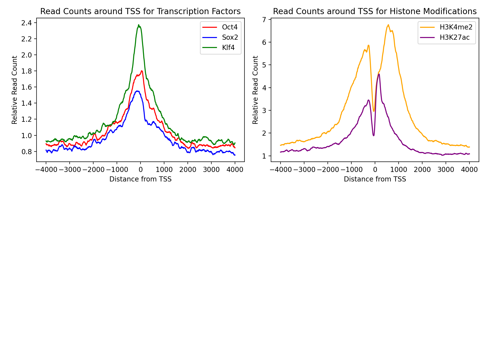
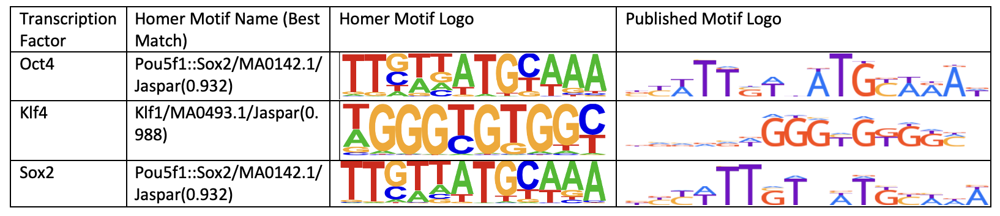
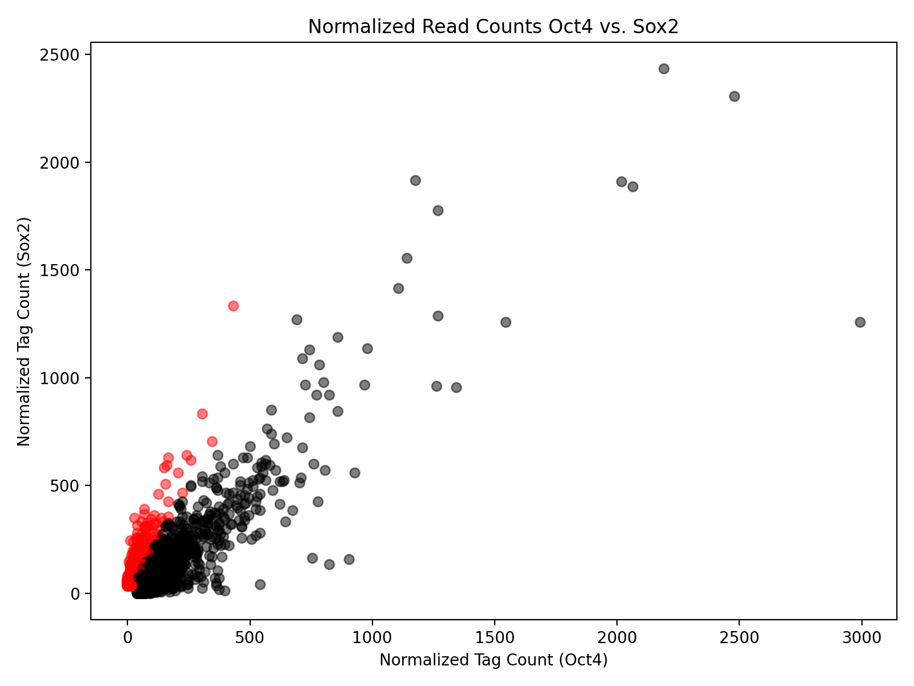
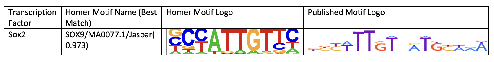

# Lab 5: The dark matter of the genome (ChIP-seq)

## Intro
In 2006, there was a striking discovery that if you treat adult cells with a specific set of transcription factors, they could become "pluripotent", meaning they can then be programmed to theoretically any type of cell. These four transcription factors (Oct4/*Pou5f1*, Sox2, cMyc, and Klf4) are collectively known as "Yamanaka factors" (named after Shinya Yamanaka's lab, which originally showed this).

In this lab, we will analyze ChIP-sequencing from three of these factors (Oct4, Sox2, and Klf4) as well as two histone modifications (H3K4me2 and H3K27ac, which often mark regulatory/enhancer regions) in mouse embryonic stem cells, which are pluripotent and express the Yamanaka factors. We'll use the ChIP-seq data to determine where these factors and modifications are binding and which specific sequence motifs the factors are binding to.

In this lab, we'll go through:
1. Aligning ChIP-seq reads to a reference genome
2. Visualizing ChIP-seq data in IGV.
3. Identifying binding sites from ChIP-seq data ("peak calling")
4. Visualizing patterns of transcription factor and histone modification binding.
5. Motif finding to identify the sequence a transcription factor binds to.

### Summary of data provided
Data for this week can be found in `~/public/lab5`. You should see:

* `Oct4.esc.fastq`: reads from ChIP-seq of the transcription factor Oct4.
* `Klf4.esc.fastq`: reads from ChIP-seq of the transcription factor Klf4.
* `Sox2.esc.fastq`: reads from ChIP-seq of the transcription factor Sox2.
* `H3K27ac.esc.fastq`: reads from ChIP-seq of the histone modification H3K27ac.
* `H3K4me2.esc.fastq`: reads from ChIP-seq of the histone modification H3K4me2.
* `input.esc.fastq`: reads from an input control (whole cell extract) for the ChIP-seq. Recall this comes from performing ChIP-seq but without the antibody pull down step.

The mouse reference genome can be found at: `~/public/genomes/GRCm38.fa` (build GRCm38). For this week, we have also added the corresponding bwa index files in the same directory.

**Acknowledgements**: Parts of this lab are modified from material originally written by Chris Benner and revised by Alon Goren.

## Aligning ChIP-seq reads

Before getting started, it is always a good idea to get some basic stats on the data you're dealing with.

**Question 1 (5 pts)** Summarize the datasets we are starting with: what samples are we analyzing? Where did they come from? How many reads are there in each dataset, and what is the read length? You can get this information by inspecting the fastq files provided and based on the description above.

We have 5 fastq samples to anaylze, and 1 control. 3 of the samples are reads from ChIP-seq of the transcription factors Oct4, Klf4, and Sox2, which are all Yamanaka factors. These factors, along with one more, can be used to treat adult cells to become pluripotent. The other two samples are reads from ChIP-seq of the histone modifications H3K27ac and H3K4me2. These modifications are found in mouse embronic stem cells, which are pluripotent, and they often mark regulatory/enhancer regions. Our input sample is our countrol for ChIP-seq, which comes from performing the ChIP-seq experiment but wihtout the immunoprecipitation with a specific antibody. 

The reads and read length for each data set can be found below:

|Dataset          | # of reads| Read length|
|:---------------:|:---------:|:----------:|
|Oct4.esc.fastq   |1999998    |50          |
|Klf4.esc.fastq   |1999998    |50          |
|Sox2.esc.fastq   |1999998    |50          |
|H3K27ac.esc.fastq|1711167    |50          |
|H3K4me2.esc.fastq|1999998    |50          |
|input.esc.fastq  |1999998    |50          |

#### As in our previous NGS analyses, the first step will be to align the reads to a reference genome. We recommend using `bwa mem`. Type the command at the terminal to see usage, or look back to Lab 1 to recall the syntax for running BWA. The genome at `~/public/genomes/GRCm38.fa` has already been indexed using `bwa index`.

**Question 2 (5 pts)** Summarize the methods you used to align the data. What aligner and version did you use? What build of the reference genome?

To align the data, I used the bwa mem command with the aligner version 0.7.17-r1198-dirty, using the GRCm38.fa mouse genome. I sorted and indexed the resulting BAM files using samtools version 1.9 (using htslib 1.9).

**Question 3 (5 pts)** What percentage of your reads from each dataset were successfully aligned? Recall `samtools flagstat` can be used to easily find this number.

(Alignment might take a couple minutes. In the mean time, you might want to get started installing and exploring IGV in part 3).

|Dataset          | % of reads aligned| 
|:---------------:|:---------:|
|Oct4.esc.fastq   |99.87%    |
|Klf4.esc.fastq   |99.61%    |
|Sox2.esc.fastq   |99.63%    |
|H3K27ac.esc.fastq|99.72%    |
|H3K4me2.esc.fastq|99.62%    |
|input.esc.fastq  |99.54%    |

## Visualizing the data with IGV

Next we will visualize the ChIP-seq experiments by creating [bedGraph files](https://genome.ucsc.edu/goldenPath/help/bedgraph.html) from the tag directories and using the IGV genome browser to look at the results. BedGraph files are similar to BED files we've seen in the past (with chrom, start, and end columns) except now with a 4th column giving a datavalue. These files are useful for describing how many reads aligned to each region of the genome.

**Question 4 (10 pts)** Based on visual inspection of the datasets on IGV, where are the peaks for each of the datasets falling (promoters? gene regions? exons? elsewhere?). How do the signals for the transcripton factors (Oct4, Sox2, and Klf4) compare to the signals for the two histone modifications? What does the input signal look like? Include a screenshot of the IGV visualization in your report. The lecture slides provide some hints for the types of patterns you should be seeing for each dataset.

The peaks for the transcription factor datasets fall in promoter regions, instrinsic gene regions like exons and introns, and some regions far away from genes that are likely enhancers or other regulatory regions. The histone modification datasets' peaks also fall in promoter regions, but since these peaks span much larger parts of the genome, some peaks span larg portions/entire genes or large chunks away from genes likely in enhancer or other regulatory regions. 

The signals for the transcription factos are much narrower and focal (~100bp) compared to the signals for the histone modifications, that are spannin several kB.

In regions where there are peaks in any of the datasets, the input signal is significantly lower than the specific dataset.

## Identifying binding sites (peaks)

One of the most common tasks with ChIP-seq data is to find regions that enriched (compared to a control like whole cell extract). These enriched regions are commonly called "peaks". We will use the `findPeaks` utility from Homer, which takes tag directories as input and outputs a set of peak regions.

**Question 5 (8 pts)** Summarize the methods you used to call peaks for each sample the data. Then, summarize peak-finding results: what was the IP efficiency reported for each dataset? How many peaks did you find? What was the average peak size for each dataset? Note you should only have 5 peak sets, since you won't have peaks for the input control.

To call peaks, I ran the findPeaks utility from Homer on each tag directory with the input tag directory as the control,  the "-style factor" option for the transcription factor samples, and the "-style histone" for the histone modification samples. 

Below are the peak-finding results:

|Dataset| IP efficiency| # of Peaks|Average peak size|
|:-----:|:------------:|:---------:|:---------------:|
|Oct4   |2.65%         |2203       |75               |
|Klf4   |3.12%         |3020       |75               |
|Sox2   |2.74%         |2235       |75               |
|H3K27ac|28.57%        |2102       |500              |
|H3K4me2|70.02%        |3060       |500              |

## Visualizing binding patterns

We will next use the Homer utility `annotatePeaks.pl` to learn about where our peaks are falling. This tool can do a lot of different things. For now we'll use it to visualize read counts around promoter regions.

**Question 6 (10 pts)** Generate a composite plot showing the distribution of read counts each of the datasets around TSSs. Plot transcription factors and histone modifications on separate plots to more easily see differences. Your plot should show:

* x-axis: gives the distance from the TSS. It should range from -4000 (4kb upstream of TSSs) to +4000 (4kb downstream).
* y-axis: gives the relative read (tag) count. This is given in the columns with "Coverage" in the header in the `tss_histogram.txt` file generated above.
* You should have one line per dataset, with a separate color for each.
* Examples of what this should look like are given in the lecture slides.

Be sure to label your axes and provide a legend or description of which color denotes which dataset.

## Motif finding

Now that we have an idea where these factors are binding, we'd like to know what type of sequences they bind to. Motif finding is a powerful technique to identify specific patterns of DNA sequence that are bound by a particular transcription factor. To use HOMER’s motif analysis program, run the findMotifsGenome.pl command using peak files from the experiments.

**Question 7 (7 pts)** Briefly summarize the methods you used to perform motif finding. Which motifs did you find to be most enriched for each factor? How do these compare to published logos for these factors? Include a figure comparing them.

See: http://hocomoco11.autosome.ru/mouse/mono?full=false for published motifs for many mouse factors, including Klf4, Pou5f1/Oct4, and Sox2.

I used the findMotifs.pl command from the HOMER motif analysis program to perform motif finding using the GRCm38.fa reference genome and the peaks file for each transcription factor. Below are the most enriched de Novo motif for each factor according to Homer and a comparison to published logos for these factors:

These motifs align well to the published motifs, with most differences coming in the parts of the motifs that are not a consensus, where there is less of a clear winner for which base has the highest position weight. There is a very strong similarity between the motifs for Sox2 and Oct4, especially in the consensus parts of the motif sequence. 

## Differential binding

You might have noticed a strong similarity between the motifs of Sox2 and Oct4! On IGV you'll see these often bind together. In this section, we'll see if we can find a motif that is specific to Sox2 binding, rather than Sox2+Oct4 binding.

First, merge the peak sets from the two factors so you just have one set of regions to analyze. Now, you can compare read counts from Oct4 vs. Sox2 in these merged regions. 

**Question 8 (6 pts)** Make a scatter plot comparing normalized read counts for Oct4 vs. Sox2 that you got from the merged peak set. Highlight peaks (using a different color) that correspond to peaks with two-fold higher binding in Sox2 vs. Oct4.

**Question 9 (6 pts)** Repeat motif finding, but this time using only the peaks that were unique to Sox2 (fold change >2). Report the motif you found. Is this different than the motif you found when analyzing *all* Sox2 peaks? Does this match to published motifs for Sox2?

The motif that was the most enriched was different that the one that I found when analyzing alll Sox2 peaks. Below is the comparison between this new motif and the published motif for Sox2. These two motifs do share some similaritaries in their consensus bases, but they don't exactly match. 

## Discussion Questions

**Question 10 (4 pts)** You should find that two of the transcription factors have very similar motifs to each other. Which two? Read about these factors (e.g. wikipedia) and hypothesize why we found these factors binding to the same motif.

Oct4 and Sox2 have very similar motifs. Both of these transcriptions factors are essential for puripotenty and self-renewel of undifferentiated embryonic stem cells. They can form complexes with each other and other transcriptional regulators like NPM1 to regulate a number of genes controlling pluripotency. Due to their similar function and the fact that the can form a heterodimer together, these two proteins can bind DNA together and their DNA binding sites are often adjacent to each other, leading to their similar motifs.

Source: Oct4 and Sox2 Wikipedia

**Question 11 (4 pts)** There are many Oct4 motifs in the genome that are not actually bound by the Oct4 TF. Why do you think that is? Besides motif occurrence, what else do you think we could use to determine whether a TF is bound to a particular motif? (There are many possible answers).

There are several reasons that could explain why there are many Oct4 motifs in the genome that are not actually bound by the Oct4 TF, and generally what is used to determin whether a TF is bound to a particular motif. One reason could be that the motifs are bound by nucleosomes, and therefore are not accessible or open to any TF trying to bind there. Some of these motif locations might need a cofoctor for Oct4 or some other TF to bind that is not present in the cell, or the motif is next to another binding site where a protein is currently blocking the target TF from binding. The sequence around the motif can have sequence features that influence chromatin accessibility and TF binding, and whether or not some TFs will act cooperativity or combinatorially, all affecting whether a TF is bound to a particular motif or not. 

## References

To read more about the data used for this lab see: https://www.ncbi.nlm.nih.gov/pubmed/28111071
