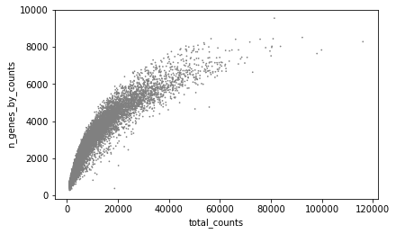

# Lab 6: scRNA-seq


**Acknowledgements**: Helpful corrections to previous versions of this lab were identified by Faith Okamoto.

## Intro

In this lab, we will analyze scRNA-seq data of human pancreatic cells which were derived from stem cells.
By analyzing single-cell data from multiple stages across the differentiation process all the way from stem cells to pancreatic islets, we can also learn about the genes that go up and down across the different stages of development.

We will look at single-cell RNA-seq data generated using 10X Genomics technology. Data is taken from the paper: [Functional, metabolic and transcriptional maturation of human pancreatic islets derived
from stem cells](https://www.nature.com/articles/s41587-022-01219-z.pdf) which it will be helpful for you to refer to (focus on Figure 5) as you go through the lab. The paper produces data for many stages of differentiation of stem cells into pancreas cells, and after those cells are transplanted into mice. We focus on just three of the time points to save computational time:

* Samples "GSM5114461_S6_A11" and "GSM5114464_S7_D20" are taken from two different time points (stages 6 and 7) of in vitro differentiation of stem cells into pancreas cells.
* Sample "GSM5114474_M3_E7" was taken 3 months postimplantation, after the cells were implanted into mice.

In this lab, we'll go through:
* Loading single-cell data into Scanpy.
* Basic filtering and QC
* Correcting for batch effects
* Using dimensionality reduction techniques (PCA), clustering (Leiden) and visualizations (UMAP, t-SNE) to visualize and identify cell type clusters


## Summary of data provied

Data for this lab can be found in `~/public/lab6`. You should see the following datasets. which were generated by the 10X Cell Ranger pipeline. The file formats will be discussed during lecture.

* Stage 6 in vitro: `GSM5114461_S6_A11_matrix.mtx.gz`, `GSM5114461_S6_A11_features.tsv.gz`, and `GSM5114461_S6_A11_barcodes.tsv.gz`
* Stage 7 in vitro: `GSM5114464_S7_D20_matrix.mtx.gz`, `GSM5114464_S7_D20_features.tsv.gz`, and `GSM5114464_S7_D20_barcodes.tsv.gz`
* Month 3 postimplantation: `GSM5114474_M3_E7_matrix.mtx.gz`, `GSM5114474_M3_E7_features.tsv.gz`, and `GSM5114474_M3_E7_barcodes.tsv.gz`

Note, to save computational time we are not actually running Cell Ranger ourselves on the raw fastqs, and instead are starting from the counts matrix. Most single-cell papers will make the count matrices available on GEO. The count matrices used in this lab were taken from: https://www.ncbi.nlm.nih.gov/geo/query/acc.cgi?acc=GSE167880.

## Summary of computational tools

The majority of this lab will be completed using a Python library, [scanpy](https://scanpy.readthedocs.io/en/stable/), built for performing many types of single-cell analyses. 

Another very population package for single-cell analyses is [Seurat](https://satijalab.org/seurat/), which is written in R. You are welcome to use Seurat for this lab if you prefer R.

Most common single-cell analysis procedures are implemented in both of these libraries.

## 1.  Loading the data

<font color="red">**Question 1 (10 pts)**</font> What python library and version did you use to load in the feature barcode matrix? How many datasets did you load and where did they come from? How many genes and total cells were included in the loaded data for each dataset?

To load and read the datasets, which are "AnnData" objects, I used the scanpy library version 1.9.3. 

I loaded 3 count matrix datasets generated by the 10X Cell Ranger pipeline:  GSM5114461_S6_A11 from stage 6 in vitro differentiation of stem cells into pancreas cells, GSM5114464_S7_D20 from stage 7 in vitro diffferentiation, and  GSM5114474_M3_E7 from 3 months postimplantation in mice.

|Dataset|# of cells|# of genes|
|:-----:|:--------:|:--------:|
|GSM5114461_S6_A11| 4793 | 20621|
|GSM5114464_S7_D20| 4910 | 20621|
|GSM5114474_M3_E7 | 2654 | 20621|
|combined         | 12357| 20621|


## 2. Filtering and normalizing your dataset

#### 2.1 Initial filtering
Before we start the analysis, we need to preprocess the data and filter out the poor quality parts of the matrix. We will perform two levels of filtering:

* Filtering *cells*: We will want to filter cells (columns) that don't look very reliable. For example, one sign a cell didn't get sequenced very well is if not that many genes are expressed (lots of zero counts).
* Filtering *genes*: We will want to filter genes (rows) that are not expressed in at least some of our cells since those won't be very interesting. We will also filter genes that are not expressed highly enough for us to get good data.

Filter out the cells that have less than 200 genes expressed, cells that have less than 1000 total reads, genes that are detected in less than 5 cells, and genes that have a total count of less than 15.

<font color="red">**Question 2 (10 pts)**</font> Report any filtering steps you did to remove low quality cells or genes based on the filters described above. Report the number of cells and number of genes remaining after the filtering steps above.

On the combined datatset, I filtered out cells with less than 1000 total reads and/or less than 200 genes expressed. I also filtered out genes that are detected in less than 5 cells and/or genes with less than a total count of 15.

The number of cells remaining in the combined dataset are 10133. The number of genes remaining in the combined dataset are 15779. 

#### 2.2 Filtering cells with high mitochondria gene expression

Let's next look at the most highly expressed genes in the dataset. 

These genes starting with "MT-" are expressed from mitchondria, which are circular pieces of DNA present in cells at high copy number. High numbers of mitochondrial transcripts are indicators of poor sample quality. This could mean the cell is undergoing apoptosis (dying) or for some reason has higher than normal metabolic activity. For our analysis, this is not the case and we wouldn't want to cluster our cells based off of cells' stress levels. So, we would like to filter cells for which a high percentage of reads are coming from mitochondrial genes.


<font color="red">**Question 3 (10 pts)**</font> Describe the steps you took to filter cells with a high percent of mitochondrial genes. If you did any other filtering, describe that here as well. Report the number of cells and number of genes remaining after the filtering steps above. Include violin and scatter plots you generated to justify your filtering steps.

Below are the violin and scatter plots of QC metrics I used to determine what outliers to filter.





I filtered out cells with a percentage of mitochondrial genes greater than 25%. I also filtered out cells with a total count of over 60000, and cells with gene counts over 7500. 

The number of cells remaining in the combined dataset are 8670 and the number of genes remaining are 15779. 

#### 2.3 Normalizing counts

Finally, we'll need to do some normalization so we can compare expression across cells below. Before normalization, the total reads derived from each cell may differ substantially. We will want to transform the data by dividing each column (cell) of the expression matrix by a “normalization factor,” an estimate of the library size relative to the other cells. It is also standard practice to log transform our data to decrease the variability of our data and transform skewed data to approximately conform to normality.

Total-count normalize (library-size correct) the data matrix to 10,000 reads per cell, so that counts become comparable among cells. Then logarithmize the data.

## 3. Identifying highly variable genes

In our clustering analysis below, we will want to focus on the genes that are most variable across cells. If a gene is expressed at the same level across all cells, it won't be very interesting.

We will use **dispersion** to quantify the variability of each gene. Dispersion is a measure of how "stretched" or "squeezed" a distribution is and is typically computed as "variance/mean" (other metrics are sometimes used). Higher dispersion means higher variability. In Scanpy, genes are first binned based on mean expression levels. Normalized dispersion for each gene is then computed as the absolute difference between the gene's dispersion and the median dispersion of genes in that bin, divided by the median deviation within each bin. This means that for each bin of mean expression, highly variable genes are selected.

<font color="red">**Question 4 (10 pts)**</font> Describe any methods you used to find highly variable genes. How many genes are in your highly variable set? What are the top 5 most variable genes? Why do we only care about the genes that differ between the cells?

I used the `highly_variable_genes` function with the options `batch_key="dataset"` and `n_top_genes=500` to get the 500 most highly variable genes in each dataset. Below are the top 5 most variable genes:

|Gene |Normalized Dispersion|
|:--: |:-------------------:|
|PPY  |12.726539            |
|NPY  |12.345587            |
|LYZ  |9.732418	            |
|KRT17|8.311301	            |
|NTS  |8.257049             |

We only care about the genes that differ between the cells because we want to know more about how gene expression is changing during the different stages of differentiation from stem cells to pancreatic cells and if there are genes that are very specific to a certain cell type. If the gene expression levels are the same across all cells,  there won't be much change to analyze about specific genes' correlations with specific cell types and it won't be too informative for clustering in downstream analysis. 

For the analyses below, we recommend making a new anndata object, which contains only:
* Highly variable genes
* Genes in the set of cell-type specific marker genes used in the paper (see below). We will manually add these back, since we want to analyze them even if they didn't make the cut for being most differentially expressed.


## 4. Removing batch effects

Our dataset above is combined across three separate single-cell experiments. Whenever we combine data from different sources, there is a possibility of introducing "batch" effects, in which there are systematic differences between them due to technical reasons (e.g. they were handled by a different technician, performed on a different machine, collected at different times of day, etc.).

To visualize batch effects, let's first perform principal components analysis (PCA) on our dataset and plot the data along the first two PCs. You should see some evidence of batch effects in your PCA plot.

Now, we'd like to adjust the count data to control for batch effects. For this, we'll use [Harmony](https://portals.broadinstitute.org/harmony/articles/quickstart.html), which works by adjusting the PCA embeddings.

<font color="red">**Question 5 (10 pts)**</font> Describe how you performed batch correction on your dataset. Which tool did you use? Which version? What parameters did you set and what do they mean? Show the PCA plots before and after batch correction. Describe any overall trends you see in the PCA plot (e.g., is one dataset very different than the rest?)

Here is the PCA plot before any batch correction:


Before batch correction, the GSM5114461_S6_A11 and GSM5114464_S7_D20 datasets show similar structure in the PCA plot but are slightly offset, while the GSM5114474_M3_E7 dataset is very different from the rest.

I used the `sce.pp.harmony_integrate` tool from harmonypy version 0.0.9 in the scanpy.external library to correct for batch effects. I used the `'dataset'` parameter to run harmony on each dataset, the `theta=2` parameter to encourage diversity among clusters, the `nclust=50` parameter to set the number of clusters in the modely, the `max_iter_harmony = 10` parameter to set the max number of runs to run Harmony, and the `max_iter_kmeans=10` paramenter to se the max number of runs to run K-means, which helps cluster the points.

Here is the PCA plot after the described batch correction:


After batch correction, the GSM5114461_S6_A11 and GSM5114464_S7_D20 datasets have become a little more differentiated, but are still similar, and the GSM5114474_M3_E7 dataset is still noticibly different from the rest along PC1 and PC2. 


## 5. Visualizing cell clusters

We will perform clustering on our data to identify individual cell types, and visualize the results using two different methods: t-SNE and UMAP.


<font color="red">**Question 6 (10 pts)**</font> Describe how you performed clustering on your dataset. Show UMAP and t-SNE plots colored by cluster assignment vs. colored by the dataset of origin. How do your results compare to Fig. 5 of the paper? (https://www.nature.com/articles/s41587-022-01219-z.pdf) Do any clusters contain cells from multiple datasets? There should be some overlap (i.e., some cell types will be present in more than one dataset). But, you will likely also find the cell types are pretty distinct across datasets, especially for "M3" compared to "S6" and "S7".


To perform clustering, I ran the `sc.pp.neighbors` command on my `adata_var` dataframe with the parameter `n_neightbors=10` to set the general size of the local neighborhood for neighboring data points, and `n_pcs=50` to use the top 50 PCs that we calculated from the harmony tool.


The samples GSM5114461_S6_A11 and GSM5114464_S7_D20 do overlap and some of the clusters contain cells from both of these datasets in the UMAP and tSNE plots. In comparison, the sample GSM5114474_M3_E7 are pretty distinct from the other two datasets and don't have overlapping clusters as much. The results in Fig.5 show clusters from more stages of the differentiation process, but you can see more distinct clusters for the M3 sample, with there being more overlap between the S6 and S7 samples. 

## 6. Assigning cell types to clusters

Finally, we'd like to try and assign cell types to some of our clusters. One way to do this is to use a set of known marker genes that are known to be expressed in certain cell types. The authors list the marker genes they used in their methods section, which we have listed below.

```
genes = ["GCG", "TTR",  "IAPP",  "GHRL", "PPY", "COL3A1",
    "CPA1", "CLPS", "REG1A", "CTRB1", "CTRB2", "PRSS2", "CPA2", "KRT19", "INS","SST","CELA3A", "VTCN1"]
```

For example:
* GCG is a marker for alpha cells, which secrete the hormone glucagon
* SST is a marker for delta cells, which secrete the hormone somatostatin
* INS is a marker for beta cells, which produce insulin and are the most abundant of the islet cells

Other genes in this list are markers for unrelated cell types that might make it into the sample through contamination. e.g. COL3A1 is a collagen gene which is expressed highly in fibroblasts, and KRT19 is a marker gene for epithelial cells.


<font color="red">**Question 7 (10 pts)**</font> Use expression patterns of the marker genes to assign your clusters to individual cell types. You should identify at least three different cell types your clusters correspond to. You may wish to refer to the original paper for more info on which genes are markers for which cell types. Include a plot (tsne or UMAP) where you label the cell types you identified.


## 7. Discussion questions

<font color="red">**Question 8 (7 pts)**</font> Summarize overall differences in terms of the cell types you see in the earlier in vitro (S6/S7) vs. later post-implantation (M3) stages.

Most of the cell types in the earlier in vitro stages, S6 and S7 are beta, alpha, and delta cell types, all cell types related to teh pancreas. The later M3 stage post-implantation show mostly beta and acinar cells, as well as some cells not necessarily related to the pancreas, like epithelial and fibroblast cells. 

<font color="red">**Question 9 (7 pts)**</font> Did you identify any cell types in your clusters that are not related to the pancreas, and thus might have arisen through contamination? Are those more prevalent in the S6/S7 or M3 dataset? Hypothesize why.

There were some cell types, like epithelial and fibroblast, that are not related to the pancreas. These are more prevelent in the M3 dataset thatn the S6 and S7 datasets. This could be that the M6 dataset comes post-implmentation intp the mouse, so there could be some contamination when collected the sample, vs. S6 and S7 coming from in vitro samples of stem cells that were still in the differentiating and have not been implanted in mice. In in vivo conditions, like in the M3 dataset, there can be interactions occurring in the host that are not found when in vitro that can lead to unexpected cell types in samples. 

<font color="red">**Question 10 (6 pts)**</font> Read through the methods section of the [paper](https://www.nature.com/articles/s41587-022-01219-z.pdf) titled "scRNA sequencing analysis". Describe at least two steps the authors took prior to obtaining their final UMAP plot that we did not include in our own analysis. Hypothesize how that might impact the resulting clusters you identified.

One step the authors took that we did not was to reduce background RNA contamination from disrupted cells using SoupX, and then repeat the Seurat analysis. This probably would have made the clusters tigher and there be less reads of genes that belong to cell types unrelated to the pancreas, leading to the less clusters related to non-pancreatic cell types. 


Another step the authors took that we did not was identifying the top 1,000 variable genes separately for each sample, and then combine them during analysis. We only found the top 500 genes in each of our 3 datasets. The clustering might have been more distinct or clear with more top variable genes from each dataset, as more read counts could have been aggregated to the previously identified top variable genes. There's also a possibility that new clusters could have been introduced from genes that were not in our top 500 variable genes, although it is unlikely that these genes would be prominent enough to appear in the clusters if they weren't already using the top 500 varibale genes. 


